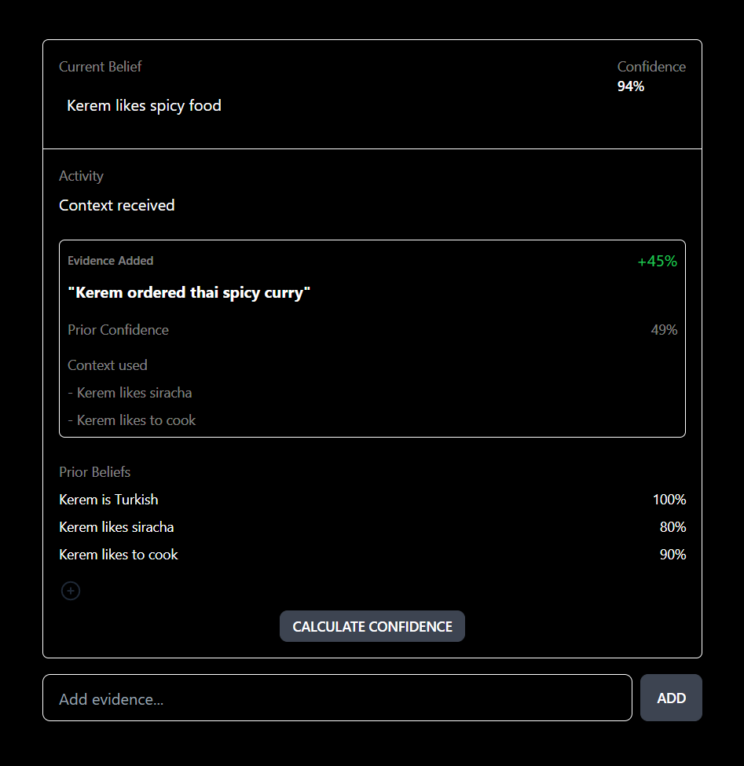

# llm-world-models
Make sure LLMs say true things.

This repo is inspired by the [tweet](https://twitter.com/evanjconrad/status/1627173324513230849) and [blog post](https://evanjconrad.com/posts/world-models) by Evan Conrad on using bayesian theory to build "world models" that may be used by LLMs to coerce factual answers w/ associated confidence levels.

run `pip install -r requirements.txt` and create a `.env` file with your `OPENAI_API_KEY` for use with Langchain.

The `example_*.py` scripts can be used as an entry point.

The `agent` directory currently has an experimental agent that can incrementally update its world model as it chats with a user.

## Preview results (WIP)

